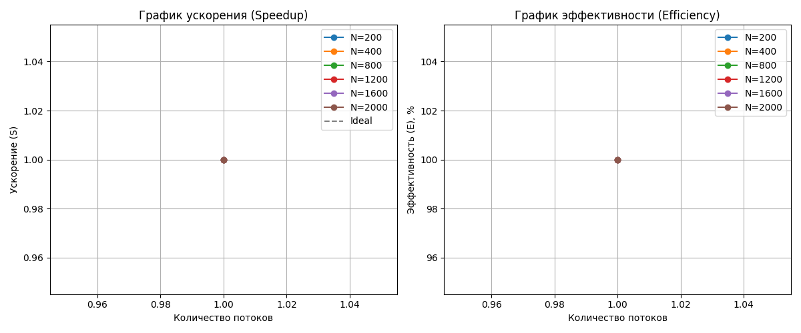

# Лабораторная работа №1: Последовательная реализация задачи N-тел

## Описание
Программа моделирует гравитационное взаимодействие $N$ тел в трехмерном пространстве по закону всемирного тяготения Ньютона. Данная реализация является базовой (Baseline) и служит для оценки производительности перед внедрением параллельных технологий (OpenMP, MPI, CUDA).

## Технические характеристики
- **Язык**: C++20.
- **Математическая модель**: Прямое суммирование сил (All-Pairs) с временной сложностью $O(N^2)$.
- **Точность**: `float` (одинарная точность).
- **Оптимизация**: Использование векторизации **AVX2** (флаг `/arch:AVX2`), позволяющей обрабатывать несколько тел за один такт процессора.

## Результаты производительности (Baseline)
Эксперименты проводились на наборах данных от 200 до 2000 тел. Алгоритм демонстрирует ожидаемый квадратичный рост времени выполнения в зависимости от объема входных данных.

### Таблица замеров
| Размер (N) | Потоки | Время (сек) | Ускорение (S) | Эффективность (E) |
| :--- | :--- | :--- | :--- | :--- |
| **200** | 1 | 0.00056 | 1.00 | 100% |
| **400** | 1 | 0.00193 | 1.00 | 100% |
| **800** | 1 | 0.00785 | 1.00 | 100% |
| **1200** | 1 | 0.01699 | 1.00 | 100% |
| **1600** | 1 | 0.02270 | 1.00 | 100% |
| **2000** | 1 | 0.03517 | 1.00 | 100% |

### Визуализация
Ниже представлены графики ускорения и эффективности для последовательной версии, полученные в ходе автоматизированного бенчмарка.

*Рис 1. Графики Speedup и Efficiency для N=200..2000 (Baseline).*

## Анализ Memory Model
С точки зрения работы аппаратного обеспечения (CPU) и модели памяти:
1. **Cache Locality**: Использована структура **AoS** (Array of Structures). При максимальном размере $N=2000$ объем данных одного кадра составляет примерно 56 КБ. Это позволяет данным практически полностью находиться в кэше **L1/L2** одного ядра, что минимизирует задержки (stalls) при обращении к оперативной памяти (DRAM).
2. **Instruction Pipeline**: Благодаря высокому уровню оптимизации компилятора, процессор эффективно использует конвейер инструкций, выполняя векторные операции над координатами.
3. **MESI Protocol**: В данной однопоточной реализации когерентность кэша поддерживается автоматически, так как модификация данных происходит в рамках одного исполнительного ядра без конкуренции за кэш-линии.

## Верификация
Корректность вычислений подтверждена автоматизированным скриптом `verify.py`.
- **Метод**: Сравнение выходных данных C++ с эталонной реализацией на **Python (NumPy)**.
- **Результат**: ` ВЕРИФИКАЦИЯ ПРОЙДЕНА`.
- **Анализ**: Отклонение результатов не превышает заданный порог точности ($10^{-5}$), что подтверждает правильность реализации физических формул и отсутствие ошибок переполнения или некорректного доступа к памяти.