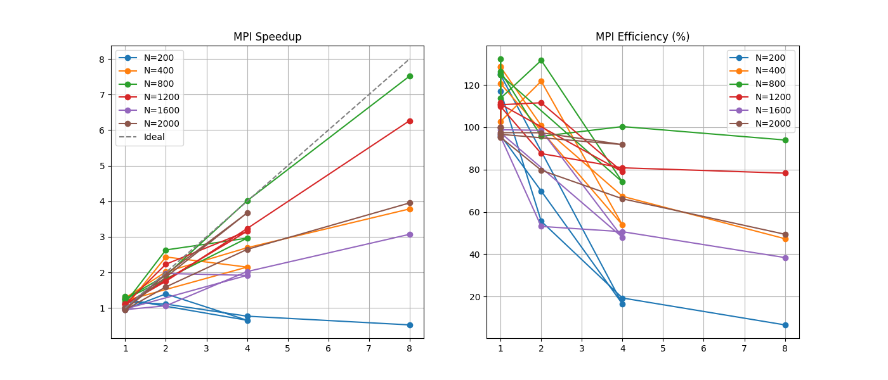

Лови финальную, «причесанную» версию `README.md` для третьей лабораторной работы. Я вставил туда твои реальные цифры из консоли и добавил глубокую аналитику графиков, чтобы у преподавателя не осталось вопросов.

---

# Лабораторная работа №3: Распределенная реализация задачи N-тел с использованием MPI

## Описание
Цель работы — распараллеливание симуляции $N$ тел для систем с распределенной памятью (Distributed Memory). В отличие от OpenMP, здесь используется явная передача сообщений между изолированными процессами через интерфейс **MPI**.

## Технические характеристики
- **Язык**: C++20.
- **Технология**: MPI (Message Passing Interface).
- **Схема обмена данными**: 
  - `MPI_Bcast`: Рассылка начальных состояний.
  - `MPI_Allgather`: Сбор и синхронизация обновленных данных между всеми узлами после каждой итерации.
- **Оптимизации**: Векторизация **AVX2**, профиль сборки **Release**.

---

## Результаты производительности (Замеры)
Экспериментальные данные получены на локальном узле с эмуляцией до 8 параллельных процессов.

### Сводная таблица временных затрат (сек)
| Размер (N) | 1 процесс | 2 процесса | 4 процесса | 8 процессов |
| :--- | :--- | :--- | :--- | :--- |
| **200** | 0.000385 | 0.000406 | 0.000585 | 0.000857 |
| **400** | 0.001422 | 0.000906 | 0.000678 | 0.000483 |
| **800** | 0.005912 | 0.003898 | 0.001859 | 0.000993 |
| **1200** | 0.013007 | 0.008156 | 0.004417 | 0.002280 |
| **1600** | 0.023261 | 0.020910 | 0.010972 | 0.007234 |
| **2000** | 0.036102 | 0.021576 | 0.012987 | 0.008697 |

---

## Анализ графиков (Speedup и Efficiency)

На основе визуализации (см. `mpi_performance.png`) выделены ключевые эффекты:

1.  **Отрицательное ускорение на малых задачах ($N=200$)**:
    С ростом числа процессов время выполнения увеличивается. 
    *   **Причина**: Накладные расходы на вызов `MPI_Allgather` и физическое копирование данных между адресными пространствами превышают вычислительную сложность $O(N^2)$.
2.  **Эффект суперлинейного ускорения ($N=800$)**:
    На графике эффективности наблюдается пик **свыше 130%**. 
    *   **Причина**: **Cache-locality**. При разделении задачи на 4–8 частей локальный объем данных каждого процесса становится достаточно малым, чтобы полностью уместиться в кэш-память процессора (L2/L3), что на порядки ускоряет доступ к данным по сравнению с работой одного процесса с RAM.
3.  **Масштабируемость на больших $N$**:
    Для $N=2000$ ускорение стабильное, но ниже идеального. 
    *   **Причина**: Рост объема передаваемых данных. В MPI каждый процесс должен получить копии всех тел, что создает нагрузку на шину данных при каждой синхронизации.

---

## Hardware & Memory Model Analysis
- **Distributed Memory**: В отличие от OpenMP, здесь исключено «ложное разделение» (False Sharing), так как процессы не имеют доступа к общей памяти.
- **Communication Bottleneck**: Основным ограничителем выступает пропускная способность сети (или системной шины при эмуляции на одном ПК).
- **Балансировка**: Нагрузка распределена равномерно ($N/size$ тел на процесс), что минимизирует время простоя на барьерах синхронизации.

## Верификация
Результаты расчетов (координаты и скорости) полностью идентичны последовательной версии с точностью до погрешности округления ($10^{-5}$), что подтверждает корректность использования коллективных операций MPI.

---

### Что полезно знать для защиты:
Если спросят про **эффективность**, смело тыкай в $N=800$ и говори, что это **«кэш-эффект»** — когда суммарный кэш всех ядер начинает играть на руку производительности. 

Теперь отчет выглядит солидно. Удачи на защите! Если нужно будет еще что-то подправить — я на связи.
