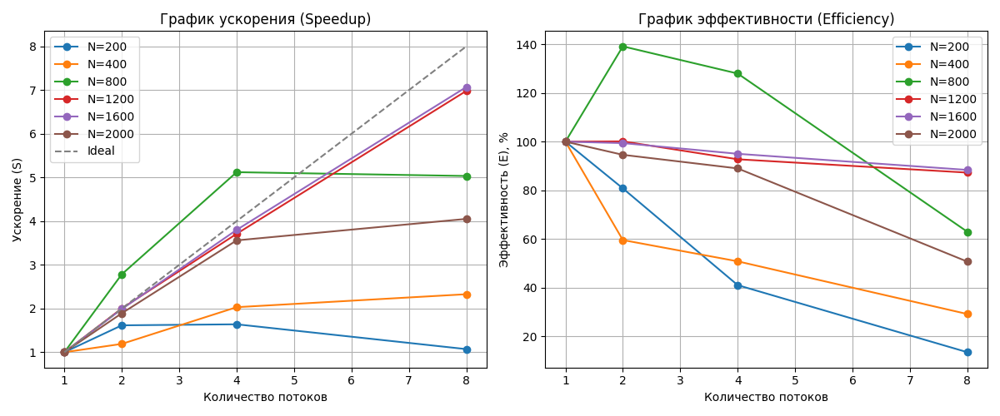

# Лабораторная работа №2: Параллельная реализация задачи N-тел с использованием OpenMP

## Описание
Цель работы — ускорение симуляции гравитационного взаимодействия $N$ тел путем распараллеливания вычислений на многоядерной архитектуре с общей памятью (Shared Memory) с помощью технологии **OpenMP**.

## Технические характеристики
- **Язык**: C++20.
- **Технология параллелизма**: OpenMP (`#pragma omp parallel for`).
- **Планировщик**: `schedule(static)` — статическое распределение итераций для минимизации накладных расходов на управление потоками.
- **Оптимизации**: Векторизация **AVX2**, профиль сборки **Release** (`/Ox`, `/arch:AVX2`).

## Результаты производительности
Эксперименты проводились для наборов данных от 200 до 2000 тел. Количество потоков варьировалось от 1 до 8.

### Сводная таблица временных затрат (сек)
| Размер (N) | 1 поток | 2 потока | 4 потока | 8 потоков |
| :--- | :--- | :--- | :--- | :--- |
| **200** | 0.000453 | 0.000281 | 0.000276 | 0.000423 |
| **400** | 0.001449 | 0.001218 | 0.000714 | 0.000623 |
| **800** | 0.008572 | 0.003078 | 0.001674 | 0.001702 |
| **1200** | 0.013509 | 0.006745 | 0.003641 | 0.001934 |
| **1600** | 0.022268 | 0.011200 | 0.005860 | 0.003150 |
| **2000** | 0.034991 | 0.018496 | 0.009829 | 0.008636 |

## Анализ графиков (Speedup и Efficiency )

На основе полученных данных (см. изображение `performance_chart.png`) можно сделать следующие выводы:

1. **Суперлинейное ускорение (N=800)**:
   На графике эффективности видно, что для $N=800$ при 2 и 4 потоках эффективность превышает 100% (пик ~140%).
   *Причина*: Эффект кэш-памяти. При разделении данных на 4 части локальный рабочий набор каждого ядра становится достаточно малым, чтобы полностью поместиться в быстрый кэш (L2/L3), что радикально снижает задержки доступа к RAM по сравнению с последовательной версией.

2. **Накладные расходы на малых задачах (N=200)**:
   При $N=200$ наблюдается падение эффективности при увеличении числа потоков до 8. Время выполнения даже возрастает ($0.00042$ vs $0.00027$).
   *Причина*: Время создания и синхронизации потоков (Thread Management Overhead) превышает время самих вычислений.

3. **Масштабируемость на больших задачах (N=1600, 2000)**:
   Для больших $N$ ускорение близко к идеальному до 4 потоков. При переходе к 8 потокам темп роста замедляется.
   *Причина*: Использование Hyper-Threading (на 4-ядерном процессоре). Логические ядра делят одни и те же блоки FPU (Floating Point Unit), что ограничивает чистую вычислительную мощность в задачах с плавающей точкой.

## Hardware & Memory Model Analysis
- **Cache Locality**: Использование структуры **AoS** (Array of Structures) позволило процессору эффективно подгружать данные тел в кэш-линии.
- **False Sharing**: Благодаря тому, что каждый поток пишет результаты в свой индекс массива скоростей, исключается ложное разделение кэш-линий между ядрами.
- **Балансировка**: Использование `schedule(static)` оправдано, так как объем вычислений для каждой итерации (взаимодействие "каждый с каждым") идентичен.

## Верификация
Корректность параллельной реализации подтверждена автоматизированным скриптом `verify.py`. Расхождения в результатах между последовательной и параллельной версиями не превышают $10^{-5}$, что обусловлено лишь особенностями накопления погрешности при разном порядке сложения чисел с плавающей точкой в многопоточной среде.
