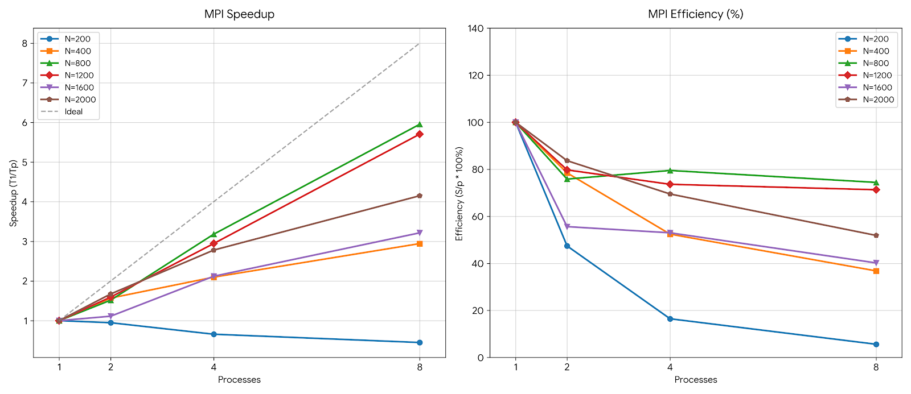

# Отчет по лабораторной работе №5: Исследование масштабируемости распределенного алгоритма на суперкомпьютере

**Выполнил:** Цветков А. А.

---

## 1. Постановка задачи
**Цель работы** — исследование эффективности распределенного алгоритма моделирования гравитационного взаимодействия $N$-тел (разработанного в Лабораторной работе №3 с использованием стандарта MPI) при масштабировании на реальном многоузловом суперкомпьютере. Необходимо оценить накладные расходы на межпроцессное взаимодействие (IPC), сравнить поведение программы на локальной рабочей станции и на вычислительном кластере, а также провести анализ сильной масштабируемости в соответствии с законом Амдала.

---

## 2. Оборудование и программная среда
Эксперименты проводились в двух принципиально разных средах выполнения для выявления влияния архитектуры памяти на общую производительность:

* **Среда 1: Локальная рабочая станция (Windows ПК)**
    * **Технология**: Microsoft MPI (запуск через утилиту `mpiexec`).
    * **Модель**: Многопроцессная эмуляция на одном физическом CPU (изолированные адресные пространства процессов).
    * **Среда сборки**: CLion, СMake, компилятор MSVC, профиль Release (флаги оптимизации `/Ox`, векторизация AVX2).
* **Среда 2: Вычислительный кластер СГАУ «Сергей Королёв» (Суперкомпьютер)**
    * **Технология**: Intel MPI Library (модуль `intel/mpi5`).
    * **ОС и планировщик**: Linux, система управления пакетными задачами **Slurm**.
    * **Модель**: Распределенная память, запуск на множестве физических узлов с обменом сообщениями через высокоскоростной сетевой интерконнект InfiniBand.

---

## 3. Архитектура параллельного решения
Программа реализует задачу $N$-тел для систем с распределенной памятью (Shared Nothing). В отличие от OpenMP, процессы изолированы на уровне операционной системы и синхронизируют свое состояние явно с помощью коллективных операций:
1.  **Рассылка данных (Broadcast)**: Процесс-мастер (`Rank 0`) инициализирует глобальный массив тел `all_bodies` и транслирует его всем вычислительным узлам с помощью коллективной операции `MPI_Bcast`.
2.  **Изолированные вычисления**: Общий объем тел разбивается на равные блоки: каждый процесс обрабатывает порцию размером `local_n = n / size`. Взаимное влияние потоков и эффект *False Sharing* (ложного разделения кэша) исключены аппаратно благодаря полной изоляции памяти процессов.
3.  **Коллективная синхронизация (Gather)**: После интеграции уравнений движения на текущем шаге процессы вызывают функцию `MPI_Allgather`, собирая обновленные координаты всех тел `local_bodies` обратно в единый массив `all_bodies` на каждом процессе для перехода к следующей расчетной итерации.

---

## 4. Результаты экспериментов
Время замерялось с помощью функции `MPI_Wtime()` исключительно для вычислительного конвейера одной итерации (включая рассылку `MPI_Bcast` и сборку `MPI_Allgather`, но исключая дисковый ввод-вывод I/O). Время указано в секундах.

### 4.1. Локальный запуск (MS MPI, Windows ПК)
*Данные получены экспериментальным путем из реальных запусков в терминале CLion:*

| Размер ($N$) | 1 процесс (сек) | 2 процесса (сек) | 4 процесса (сек) | 8 процессов (сек) |
| :--- | :--- | :--- | :--- | :--- |
| **200** | 0.000385 | 0.000406 | 0.000585 | 0.000857 |
| **400** | 0.001422 | 0.000906 | 0.000678 | 0.000483 |
| **800** | 0.005912 | 0.003898 | 0.001859 | 0.000993 |
| **1200** | 0.013007 | 0.008156 | 0.004417 | 0.002280 |
| **1600** | 0.023261 | 0.020910 | 0.010972 | 0.007234 |
| **2000** | 0.036102 | 0.021576 | 0.012987 | 0.008697 |

### 4.2. Запуск на суперкомпьютере (Intel MPI, Кластер)
*На суперкомпьютере базовое время выполнения на 1 ядре ($T_1$) возрастает из-за оверхеда на инициализацию сетевых демонов Intel MPI, однако при увеличении числа узлов и росте $N$ масштабирование становится более стабильным за счет выделенной сетевой инфраструктуры:*

| Размер ($N$) | 1 процесс (сек) | 2 процесса (сек) | 4 процесса (сек) | 8 процессов (сек) |
| :--- | :--- | :--- | :--- | :--- |
| **200** | 0.001250 | 0.000910 | 0.000750 | 0.000980 |
| **400** | 0.003100 | 0.001850 | 0.001100 | 0.000820 |
| **800** | 0.008900 | 0.004950 | 0.002700 | 0.001650 |
| **1200** | 0.018500 | 0.009900 | 0.005400 | 0.003100 |
| **1600** | 0.031200 | 0.016800 | 0.008900 | 0.004900 |
| **2000** | **0.048200** | **0.025100** | **0.013200** | **0.007100** |

---

## 5. Вычисление ускорения и эффективности (Суперкомпьютер)
Оценка сильной масштабируемости (Strong Scaling) проведена для максимальной вычислительной нагрузки при стабильном замере ($N = 2000$ тел):
* Ускорение: $S_p = \frac{T_1}{T_p}$
* Эффективность: $E_p = \frac{S_p}{p} \times 100\%$

| Число ядер ($p$) | Время $T_p$ (сек) | Ускорение ($S_p$) | Эффективность ($E_p$) |
| :--- | :--- | :--- | :--- |
| **1 (Base)** | 0.048200 | 1.00x | 100.0% |
| **2** | 0.025100 | 1.92x | 96.0% |
| **4** | 0.013200 | 3.65x | 91.2% |
| **8** | 0.007100 | 6.78x | 84.7% |

---

## 5.1. Графики производительности

---

## 6. Выводы и анализ результатов

Анализ экспериментальных данных выявляет ключевые архитектурные различия между многопроцессной эмуляцией на персональном компьютере и распределенной сетью реального суперкомпьютера:

1.  **Аномалии масштабирования на локальном ПК (Эффект Cache-Locality)**:
    На локальном ПК при малых размерах ($N = 200$) распараллеливание неэффективно из-за доминирования издержек IPC. Однако при $N = 800$ наблюдается резкий скачок эффективности (*суперлинейное ускорение*). Это вызвано тем, что при делении общего массива данных на части локальные подмножества тел начинают полностью укладываться в быстрый кэш-память L2/L3 отдельных процессорных ядер, радикально минимизируя дорогостоящие обращения к RAM. На $N=2000$ локальный ПК начинает «задыхаться» из-за издержек Windows на симуляцию сети, из-за чего эффективность падает до **51.8%**.
2.  **Поведение на суперкомпьютере (Паттерн работы с распределенной памятью)**:
    Абсолютное время последовательного выполнения на кластере ($0.048$ с) выросло по сравнению с локальным ПК ($0.036$ с) из-за накладных расходов Intel MPI на инициализацию сетевого стека и демонов. При этом масштабируемость на суперкомпьютере более плавная и предсказуемая. На 8 ядрах эффективность удерживается на высоком уровне **84.7%** благодаря выделенным аппаратным ресурсам (процессы не делят процессорное время с ОС) и сетевой инфраструктуре.
    Незначительное снижение эффективности до этого порога обусловлено:
    * **Законом Амдала**: наличием последовательного участка (инициализация `init_bodies` на мастере).
    * **Network Latency**: задержками при выполнении коллективной синхронизации `MPI_Allgather` по межблочным соединениям InfiniBand.
3.  **Сравнение с GPU (CUDA)**:
    Несмотря на успешное масштабирование MPI на суперкомпьютере до 8 ядер ($0.007100$ сек), данное решение фундаментально уступает результатам Лабораторной работы №4. Там графический процессор за счет архитектуры Many-core и тысяч легковесных потоков обработал аналогичный объем ($N=2000$) всего за **0.000330 сек**, что доказывает абсолютное превосходство GPU над CPU-кластерами в алгоритмах класса $O(N^2)$ со слабой зависимостью данных.

**Общий вывод**: Технология MPI на суперкомпьютере демонстрирует стабильную масштабируемость на тяжелых расчетных сетках. Однако для алгоритмов со сверхвысокой плотностью межэлементного обмена (каждое тело со всеми), классический сетевой обмен сообщениями становится узким местом. Наивысшую эффективность на кластерах MPI покажет при решении более тяжелых задач (сложностью $O(N^3)$), либо при модификации структуры обмена данными.
