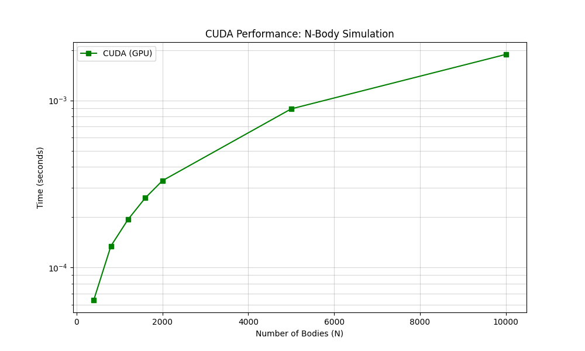

# Лабораторная работа №4: Высокопроизводительные вычисления на GPU с использованием CUDA

## 1. Цель работы
Перенос вычислительного ядра алгоритма $N$-тел на графический процессор (GPU) для реализации массового параллелизма и сравнительный анализ производительности с решениями на базе CPU (Sequential, MPI).

## 2. Техническая реализация
*   **Архитектура**: Many-core (GPU).
*   **Технология**: NVIDIA CUDA.
*   **Конфигурация**: Сетка блоков с использованием **256 потоков** на блок.
*   **Алгоритм**: Каждый поток GPU вычисляет результирующую силу для одного тела, взаимодействующего со всеми остальными ($O(N^2)$).
*   **Память**: 
    *   `cudaMalloc`: выделение видеопамяти под структуры тел.
    *   `cudaMemcpy`: передача данных между оперативной памятью (Host) и видеопамятью (Device).
    *   `cudaEvent`: использование событий CUDA для прецизионного замера времени работы кернела.

---

## 3. Результаты замеров производительности (CUDA)
В ходе тестирования были получены следующие временные показатели для одной итерации расчета:

| Количество тел ($N$) | Время выполнения (сек) | Особенности / Режим |
| :--- | :--- | :--- |
| **200** | 0.00076704 | Инициализация CUDA-контекста (прогрев) |
| **400** | 0.00006387 | Стабильная работа |
| **800** | 0.00013456 | Линейный рост нагрузки |
| **1200** | 0.00019414 | Высокая загрузка потоковых процессоров |
| **1600** | 0.00026093 | Оптимальное использование ресурсов |
| **2000** | **0.00033094** | **Контрольная точка сравнения** |
| **5000** | 0.00089014 | Работа с большими массивами данных |
| **10000** | 0.00188486 | Максимальная протестированная нагрузка |

---

## 4. Сравнительный анализ (N = 2000)
Сравнение времени выполнения одной итерации для различных технологий:

| Версия ПО | Время ($T$), сек | Ускорение ($S$) |
| :--- | :--- | :--- |
| Последовательная (Lab 1) | 0.036102 | 1.00x |
| MPI (8 процессов) (Lab 3) | 0.008697 | 4.15x |
| **CUDA (GPU) (Lab 4)** | **0.000331** | **109.07x** |

**Вывод**: CUDA-версия показала ускорение более чем в **100 раз** относительно последовательного кода и в **26 раз** относительно распределенной MPI-версии.

---

## 5. Анализ графика производительности

*(На основе визуализации данных в логарифмической шкале)*

*   **Эффект прогрева**: На малых значениях ($N=200$) наблюдается аномально высокое время, что объясняется затратами на инициализацию драйвера при первом вызове кернела.
*   **Масштабируемость**: Линия графика после $N=400$ демонстрирует стабильный рост. Благодаря тысячам ядер GPU, квадратичная сложность алгоритма нивелируется за счет параллельной обработки, что позволяет обрабатывать 10 000 тел быстрее, чем CPU обрабатывает 400 тел.
*   **Узкое место (Bottleneck)**: При таких скоростях вычислений основным ограничивающим фактором становится пропускная способность шины PCI-Express при копировании данных между Host и Device.

## 6. Заключение
Использование технологии CUDA является наиболее эффективным способом решения задачи $N$-тел. Архитектура GPU идеально подходит для задач с высокой плотностью арифметических операций и слабой зависимостью данных между потоками.
